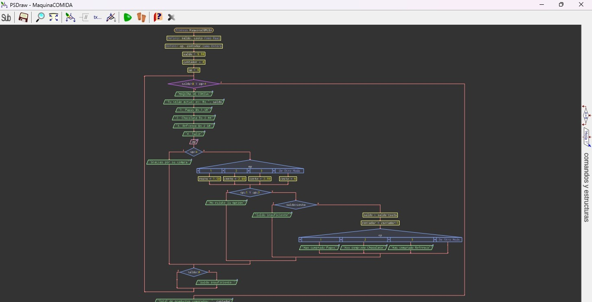

# Comida
## Descripción
Programa que simula una máquina expendedora de snacks.
## Diagrama de flujo

## Cómo ejecutar
1. Clonar el repositorio:
   git clone https://github.com/JhamilCV/Trabajo-simpl
2. Entrar a la carpeta:
   cd proyecto
3. Ejecutar el programa:
   python main.py
